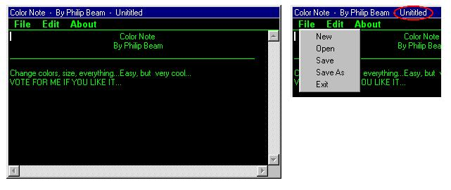



## A Color Notepad

### Description

This is a notepad that is black with green text... All the colors can be customized. It opens, saves (and save as), cuts, copies, pastes, and shows the file path (if saved or opened) on the Title bar. Demonstrates an easy way to save with a textbox... Also has horizontal and vertical scrollbars. I dont know the limit to the amount of text (if there is one). Please vote if you like it...
 
### More Info
 

             |
---                |---
**Submitted On**   |2000-07-20 14:30:12
**By**             |[Philip Beam](https://github.com/Planet-Source-Code/PSCIndex/blob/master/ByAuthor/philip-beam.md)
**Level**          |Beginner
**User Rating**    |3.5 (46 globes from 13 users)
**Compatibility**  |VB 3\.0, VB 4\.0 \(16\-bit\), VB 4\.0 \(32\-bit\), VB 5\.0, VB 6\.0, VB Script, ASP \(Active Server Pages\) 
**Category**       |[Complete Applications](https://github.com/Planet-Source-Code/PSCIndex/blob/master/ByCategory/complete-applications__1-27.md)
**World**          |[Visual Basic](https://github.com/Planet-Source-Code/PSCIndex/blob/master/ByWorld/visual-basic.md)
**Archive File**   |[CODE\_UPLOAD79757202000\.zip](https://github.com/Planet-Source-Code/philip-beam-a-color-notepad__1-9925/archive/master.zip)

